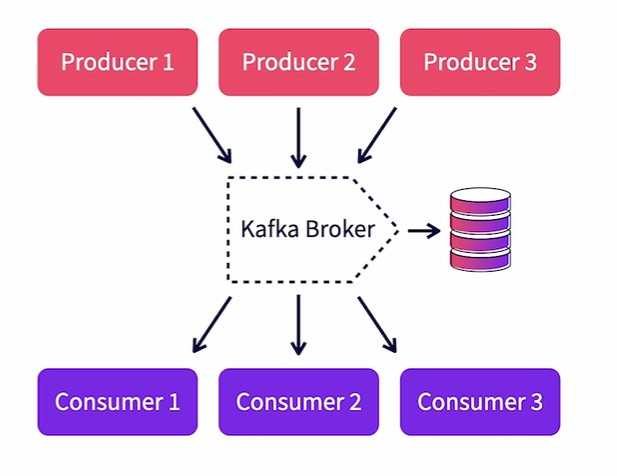
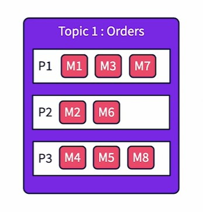

## 2. Basic concepts

In this chapter, we will explore a number of basic concepts and entities that make up Kafka architecture.

### Messages 

We start off with a Kafka message. A Kafka message is the unit of data that is collected, stored and distributed by Kafka. 
Let's explore more about messages in this video. 

A Kafka message is also called an *event*. A message is record of a real world event at a point in time. But that definition 
does not constrain what a message is. It can be any piece of data. A message is equivalent to a row or record in a database.
It can have attributes and values like a map. It can also be a blob that contains an image or an audio snippet. Kafka treats 
all messages as a byte array. It does not try to associate any semantics on the content of the message. That is the job of
the producer and the consumer. Producers and consumers need to agree upon the content and format of the message. And be able 
to serialize and deserialize them. Kafka merely takes in binaries and distributes them. Size limits exist in Kafka and the maximum size of the message. It is configurable and the default size is One MB. While producing and consuming messages, the producers and consumers can do batch processing for efficiency. What are some of the key contents of a message? Kafka does have some predefined attributes. 

Messages in Kafka have a *key*. The key is defined by the producer of the message. **Key are not mandatory** and they also need not be unique. 
Keys are used for partitioning data. We will discuss partitioning further in the course. 

The *value* attribute of the message contains the actual message. It is a binary and the semantics of the value is user defined. 
Kafka does not infer anything from the message contents. 

Another key attribute to be noted is the *timestamp*. Every message is automatically timestamped by Kafka. Kafka supports two type of automatic timestamping. Event time is when the message producer creates a timestamp. Ingestion time is where the Kafka broker timestamps it, when it stores the record. This option is configurable. Now let's look at some examples for messages. The first message is a map with attribute names and values. In this case, it's an employee record in Jason. The message key is set to the employee ID. The second message is a web server log stored in CSV format. It has no explicit key. Kafka assigns a random key when a key is not provided by the producer. The third message is an image. It has the customer ID as the key. The content is raw bytes. Note that all these messages are internally stored by Kafka as by binaries. Hence the content can take any form. As long as the producers and consumers agree on the format. Messages are stored in topics. Let's explore topics in the next video.

### Topics

Topics in Kafka hold and manage messages. Let's explore more on topics in this video. 

A topic in Kafka is an entity that holds messages. It's similar to a file that contains papers. When messages represent the papers, 
it's similar to a database table that contains records, where messages represent the records. Topics can be considered as 
a *queue*, for similar messages. A topic itself does not pose any limitation, on what the content of its message should be. So technically, a topic can contain all kinds of messages with different formats, but in practice, they're used to hold similar messages. What does similar mean in this case? Usually, the content of the messages are similar and have the same set of producers and consumers. Examples of topics include; sales transactions, audit logs, video files, etcetera. Kafka support multiple topics, per Kafka instance. So topics can be created based on specific use cases. And multiple application domains can create topics, in the same Kafka instance. Each topic support multiple producers to publish data to the topic concurrently. Similarly, multiple consumers can consume data from this topic. Each topic has multiple partitions that physically split data across multiple files. Here is an example of how topics exist in Kafka. In this case, we have one Kafka instance with two topics, orders and logs. The orders topic has three partitions, P1, P2 and P3. There are eight messages in the topic named M1 to M8. The messages are distributed across three partitions. Each message, will only be stored in one partition. Similarly, the logs topic has two partitions and six messages. We will discuss partitions in detail, later in the course. In the next video, let's discuss Kafka brokers.

### Kafka Brokers

A kafka broker is the center brain behind everything that kafka does. Let's explore more about brokers in this video. 

A broker is nothing but a running Kafka instance. It is a physical process that runs on the base operating system and executes 
all Kafka functions. A Kafka process listens on a specific port. Usually this is 9092 but it's configurable. The Kafka broker 
receives messages from producers and **stores them locally in logs**. 

Consumers subscribe to specific topics within the Kafka broker. 
The broker **keeps track of all active consumers**. It knows about the last message that was sent to a consumer. So only sends 
any new messages in the subscribe topic to that consumer. It also keeps a heartbeat with every consumer. So when a consumer dies, 
it can track and reset. 

Kafka brokers manage the life cycle of topics. They track and manage topic partitions. They also manage the corresponding partition 
logs. 
Multiple Kafka brokers can be clustered together to form a single Kafka cluster. Within a Kafka cluster, there is one Kafka 
broker instance that will act as the active controller for that cluster. 
In addition, each partition will have a corresponding Kafka broker as its leader. The leader then manages that specific partition. 
A kafka broker also takes care of replicating topic partitions across multiple brokers. So even if one broker goes down, the other 
brokers can take over the corresponding topic partitions. This provides fall tolerance for Kafka. 

In the next video, let's explore Kafka logs.

### kafka logs

Where does the data that is sent by producers stored physically? It is in the Kafka logs. Kafka logs are the physical files 
in which data is stored before they are consumed by the consumers. Logs are managed by Kafka brokers. Each broker has an 
assigned log directory where it stores the log files. There are multiple log files created in Kafka. Each broker will have 
its own log territory. And in these directory, there are separate files for each topic and partition. These are rolling 
files so when a file gets filled up it's rolled over and a new file is created to continue with the logging process. So 
each partition will have multiple log files in the log directory. 

Data in Kafka is only kept for a configured interval of time. The default is seven days. A separate thread in Kafka keeps 
pruning files that are over this period. Log files are an important consideration for managing a Kafka instance since they 
influence the amount of physical space that needs to be provisioned. 
 
Lack of space would lead to the broker rejecting data from producers and a breakdown of data processing pipelines. 
All configuration for Kafka is in the server.properties file under the conflict folder of the Kafka installation root folder. 
The log.dirs parameter is used to set the path of the log directory. 

### Producers and consumers

Producers and consumers from the ecosystem for Kafka, from feeding in data to consuming them. Let's discuss more about them in this video. A producer is any client that publishes data to Kafka. Some examples include web servers that publish web click events, a log scrubber pushing in log messages, and a sensor pushing in telemetric data. To build a producer, a developer needs to use a Kafka client library within their code and publish data. Such client libraries are available for multiple programming languages. Please check the Kafka website for more details. We will discuss Java client libraries in this course. There are multiple concurrent producers for each topic. These producers can be different physical processes or threats in the same process. It is the job of the producer to identify the key of the message. Typical keys would include customer IDs, product IDs or transaction IDs. Please note that the keys influence partition selection. Ideally, the string values for these keys should have equal distribution to ensure equal load across all partitions. The producers also need to serialize the message data to bytes. Anything can be serialized including strings, JSON, objects, or blobs. The only requirement is to make sure that the consumer can deserialize it to recreate the same data. There are synchronous and asynchronous options available for publishing to Kafka. Asynchronous options don't wait for an acknowledgement from the broker before proceeding with the next message and hence it's faster, but it also results in complex tracking of acknowledgements and republishing. A consumer on the other hand, is used to consume and use the messages from Kafka. Typical examples of consumers include a log filter, a real-time data, or a data archiver. Consumers can consume a message anytime as long as the message is stored in the log files and not pruned over. So in real time, the producer and the consumer are running at the same time and as each message is published it is immediately consumed. In batch processing, the producer can publish anytime, even in batches. The consumer process can start up at a much later time and consume all the pending records. The same client labored is used for producers will be used to consume the data by consumers. It will be a different set of function calls. There can be multiple concurrent consumers per topic and each consumer will get a complete set of messages from the topic. If scaling is needed beyond one consumer for a specific job, then consumers can be grouped into consumer groups and share the load. We will discuss consumer groups in detail later in the course. Consumers are responsible for deserializing the messages in byte format and recreating the original objects sent by producers. Consumers also can manage the offset for data that they would consume. They can consume from the start of the topic or from a specific offset. They also provide acknowledgement to the brokers once they have successfully consumed a message. Finally, let's explore the role of zookeepers in Kafka in the next video. 

### Role of ZooKeeper

Every Kafka instance or cluster needs an instance of ZooKeeper deployed along with it. Let's discuss the purpose of ZooKeeper for Kafka in this video. When we deploy Kafka, it needs an instance of ZooKeeper provision with it. ZooKeeper is a centralized service that is used for storing configuration information as well as helping with distributed synchronization. ZooKeeper serves as the central information store for Kafka. There are ongoing efforts to make Kafka independent of ZooKeeper in the future versions. ZooKeeper helps Kafka in broker management. When each Kafka broker starts up, they register themselves with ZooKeeper. They also discover about other Kafka brokers from the same ZooKeeper. One of the Kafka brokers, typically the first broker that starts up, registers itself as the active controller. It then controls and manages other brokers in the cluster. If the active controller fails, one of the other brokers will take up that role. This synchronization is handled through ZooKeeper. ZooKeeper is also used to manage topics. All topics and their partitions are registered with ZooKeeper. It is used to track and manage broker leaders for each of the partitions. Again, failure recovery is synchronized through ZooKeeper. It is recommended to install ZooKeeper as a cluster in production environments to provide fault tolerance. Now let's start to use Kafka for creating topics and publishing data in the next chapter.

## 3. Using the Kafka CLI

### Kafka client scripts

In this chapter, we will explore the command line options in Kafka for managing topics. As for less publishing and subscribing. In this video, we will explore various client shell scripts that are available in Kafka. To begin with, we need to log into the Kafka container using the Kafka exec command. We do so by using the docker exec -it, Kafka-broker /bin/ bash command. This will take us into the Kafka container. Now let's navigate to the root directory for Kafka here. Kafka is installed under op bitnami Kafka. Let's explore the contents here. The config directory contains configuration that can be modified to suit the specific setup. Any configuration changes would require a restart of Kafka. Do note that these files are inside the container and restarting the container would reset the files to the original value. If you need to modify and use these files, use host volumes. The logs directory contains log files generated by Kafka and are useful for troubleshooting. The bin directory contains a number of shell scripts for Kafka management, publishing, and subscribing. Let's explore the directory in detail. The bin directory contains a number of shell scripts that can be used to interact with Kafka. The kafka-server-start.sh, and kafka-server-stop.sh scripts can be used to start and stop Kafka. We will explore other scripts later in the course. Now we can start creating some topics in the next video.

### Creating a topic

In this video, we will create two topics in Kafka. I will first explore the topic creation command first. It's available in the chapter-3-commands.txt file inside the Kafka getting started project. The script to use for creating topics, is the Kafkatopics.sh file. What are the parameters for the script? First, we need to provide the link to Zookeeper. Topics are stored and managed in Zookeeper, so the creation command needs that information. Then comes the action, which in this case is create. We need to provide the name of the topic, with the topic parameter. While the name can be any string, it's recommended to use a pattern of qualified names for better management. In this case it's a tweets topic called Kafka.learning.tweets. We then specify two mandatory parameters. The number of partitions and the replication factor. We keep a partition size of one. We will discuss partitions later in the course. Replication is addressed in detail in the next Kafka course, Apache Kafka essentials, building scalable applications. For now, we keep the replication to one, since we only have one Kafka broker running. We now proceed to create the topic. We first need to log in to the Kafka container. Then we need to navigate to the bin directory. Let's run the creation command now. There is usually a warning to not use underscores and periods together. The topic is successfully created. Let's now proceed to create another topic in a similar fashion called Kafka.learning.alerts. This is also successfully created. Now, we proceed to explore the topics in the next video.

### Exploring topics

In this video, let's list and explore the topics that we have already created. How do we get a list of topics in a Kafka cluster? We used the list action. This is similar to the create action. We will provide the zookeeper location as the parameter and use the list command. If we need further details around topics, we can use the describe command. Let's run these commands and see the results. Here is the list command. It only lists the topics that got created in the system. Do note that you will also get to see additional internal Kafka topics that start with an underscore. Let's execute the describe command now. Here, we get to see a lot more details about each topic. Specifically, it provides a partition count and the replication factor. For each partition in the topic, it also shows the partition ID, which in this case is zero. Partitions are usually numbered zero to N. It then shows the broker ID for the leader of the partition. The broker ID is set for each Kafka instance in the silver.properties file under the conflict directory. We will explore more of these later in the course. Now let's start publishing some data to Kafka in the next video.

### Publishing messages to topics

In this video, I will demonstrate publishing of messages to Kafka using the command line publisher. For this, we will use the Kafka console producer.sh shell script. In order to publish, we need to provide the bootstrap server parameter, which can point to a list of Kafka brokers, we provide localhost 29092 as the value. As explained in the earlier setup video, we need to pay attention to the URL used. We are running this command from inside the container, which is within the Docker network. So we will need to use an internal host and port as the host of the same container. We can use localhost, the port should be the internal port, which is 29092, we need to specify the topic to which we are publishing data. There are other optional parameters available, which you can explore by simply using the shell script without any parameters. let's publish some data now. Let me just provide the shell script name, Kafka console producer daughter search. (typing) We get to see a list of parameters that are supported by the command. Now let's start the producer for Kafka dot learning dot tweets. We get a prompt for us to provide any message here. let's publish our first message. This is my first tweet. on pressing Enter This message is immediately sent to Kafka. We can now add more messages and keep publishing them. The programme will keep running until we press Ctrl C to abort it. This is a quick way to test if the Kafka topic has been created successfully and it is working fine. Messages once produced will be stored in Kafka until they are pruned. They can be consumed anytime. In the next video, let's consume the data produced.

### Using console consumer

How do I consume messages from Kafka? We can use the Kafka-console.consumer.sh shell script for that. The command takes the mandatory bootstrap server parameter. The same considerations we discussed in the earlier video apply here, too. We need to provide a list of topics to consume data from. We have the option to either consume all the messages by using the front beginning parameter or only consume newly created messages. Let's execute this now. For demo purposes, I have four windows open. There are two producers windows on the left, and two consumer windows on the right. As seen in the previous videos, we create separate shell sessions on the container using the same docker exec command and then navigate to the Kafka bin directory. In both the producer shells, we start the Kafka producer for the given topic. In the first consumer shell, let me start the consumer and consume data from the beginning. We see that all the messages we have published earlier in the topic show up. This command will continue to run and listen for any new messages published to the topic. On the second consumer shell, let's start the consumer and only consume new messages. We see that there are no messages published from history and it simply waits for any new messages. Now let's go to the first producer and add a new message. It's called testing two consumers message 1. We see that this message immediately shows up in both the consumers. Now, let me go to the second producer and add a new message. We again, see that this message shows up in both the consumers. This demonstrates how Kafka can receive messages from multiple producers and send them to multiple consumers at the same time. This is a simple yet powerful demonstration of Kafka's capabilities. In the next video, let's explore the Kafka topic operations.

### Topics management

The Kafka topics.sh shell script can also be used to modify and delete topics. Running just the Kafka topics.sh script shows all the parameters available to modify. Things like partition count cannot be modified though, and need to be planned ahead. To demonstrate some of this functionality, we will use the shell script to delete the Kafka learning alerts topic. We need to again provide the zookeeper parameter name and the topic name. The delete command takes care of deletion operation. Let's run this command. Running the Delete command returns a topic marked for deletion message. Deletion is not synchronous since deletion involves deleting all physical copies of data. Running a list command after some time will show if the topic is already deleted or not. In the next video, let's explore some internals of Kafka.

### Kafka setup

In this video, we will review the Kafka setup and see how things are organized inside Kafka. Let's first start from zookeeper. We will log in to the Docker instance of the zookeeper container using docker exec -it zookeeper /bin/bash. Once inside the zookeeper, let's navigate to the zookeeper bin directory. The bin directory is /opt/bitnami/zookeeper/bin. Once inside here, let us execute the zookeeper client. We are now logged in to the zookeeper client. Let us clear the screen for now. Kafka creates multiple zookeeper nodes to keep track of its configuration and status. Running ls / command shows all the various nodes available. Running ls /brokers/ids shows all the brokers that are registered with zookeeper. We only have one Kafka broker registered for now, which is 1001. Executing a get /brokers/ids/1001 shows further details about the specific broker. 

## 4. Kafka Partitions and Groups

### Intro to partitions

In this chapter, we will deep dive into partitions and how they control the ingestion, storage, and consumption of messages. 

As discussed previously, each topic in Kafka can contain multiple partitions. A topic can have 1-n partitions. The number of partitions are set up during topic creation. The maximum number of partitions per cluster and per topic varies by the specific version of Kafka. Partitions allow Kafka to scale by parallelizing ingestion, storage, and consumption of messages. It provides horizontal scalability. However, creating too many partitions may result in increased memory usage and file handles. 
Each partition has separate physical log files which of course will rollover as they reach configured sizes. 

A given message in Kafka is taught in only 1 partition. 
Each partition is assigned a broker process, known as its **Leader broker**. In order to write to a specific partition, the message needs to be sent to its corresponding leader. The leader takes care of updating its log file as well as replicating that partition to other copies. The leader will also send data to the subscribers of the partition, but multiple partitions for a topic. Consumers can share workloads by partitions using consumer groups. Partitions can also be replicated for fault tolerance purposes. 

There are a few things to note about partitions. These significantly impact the performance and latency of pipelines. 
Each published message gets stored in only 1 partition. If the partition is replicated, each replicated copy will also get an instant of this message. Message ordering is guaranteed only within a partition. So in the example provided, messages are pushed to Kafka in the order from M1 to M8. M1, M3, and M7 are guaranteed to be delivered to the consumer in the same sequence as they belong to a single partition. But on the other hand, there is no guarantee of ordering between M1 and M2 as they belong to different partitions. It is possible for M2 to be delivered before M1. The partition for a message is determined by its message key. Kafka uses a hashing function to allocate a partition based on the message key. Messages with the same key will always end up in the same partition. It is important to choose keys that have an equal distribution of its values. Otherwise some partitions may get overloaded while others will be used minimally. The number of partitions cannot be modified after the topic is created. Hence, care should be taken to set the right size for partitions during creation time. Now let's look at creating topics with multiple partitions and then publishing messages to these partitions.

